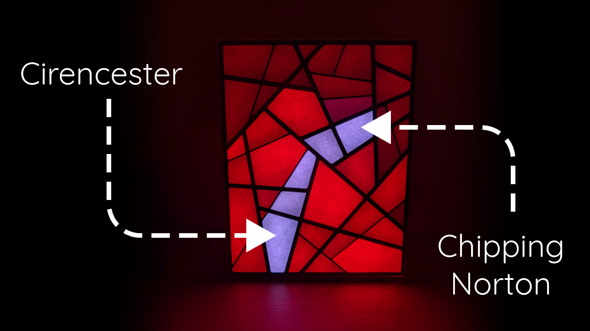

# Cotswolds LED Pathfinder

This project showcases the power of pathfinding algorithms in a visually captivating way. Using a Raspberry Pi Pico W and an array of LEDs, it brings to life a simplified map of the Cotswolds, a picturesque region in England known for its charming villages and rolling hills.

The project dynamically demonstrates Dijkstra's algorithm, a classic method for finding the shortest path between two points in a network. Watch as the LEDs illuminate the optimal route between different towns in the Cotswolds, providing a mesmerising display of computational problem-solving.

**Watch the Cotswolds LED Pathfinder in action:**
[[YouTube](https://youtu.be/ZBqJBapf_Ss)]

**Read the full project write-up:** [Link to project write-up]

## Features

- **Interactive Visualisation:** See Dijkstra's algorithm in action as the LEDs trace the shortest path between randomly selected towns.
- **Abstracted Map:** The Cotswolds are represented by a network of interconnected towns, each with its own set of LEDs.
- **Dynamic LED Display:** The LEDs dynamically illuminate to highlight the current town, its neighbours, and the calculated path, creating a captivating visual experience.
- **Educational Tool:** Provides a tangible and engaging way to learn about graph theory and pathfinding algorithms.

## How it Works

The project utilises a Raspberry Pi Pico W to run the core logic and control the LED display. The Cotswolds map is defined in the code as a series of interconnected towns, and Dijkstra's algorithm is employed to determine the shortest path between them. The LEDs then illuminate in a sequence to visually represent the algorithm's progress and the final solution.

## Purpose

This project is designed to be a captivating demonstration of Dijkstra's algorithm, bringing a classic computer science concept to life through an interactive and visually engaging display. It serves as both an educational tool and an artistic exploration of pathfinding and the beauty of the Cotswolds.
